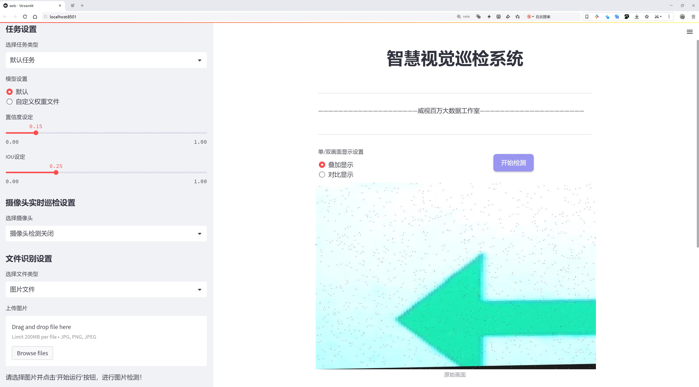

# 交通场景车辆姿态朝向检测检测系统源码分享
 # [一条龙教学YOLOV8标注好的数据集一键训练_70+全套改进创新点发刊_Web前端展示]

### 1.研究背景与意义

项目参考[AAAI Association for the Advancement of Artificial Intelligence](https://gitee.com/qunmasj/projects)

项目来源[AACV Association for the Advancement of Computer Vision](https://github.com/qunshansj/good)

研究背景与意义

随着城市化进程的加快，交通管理面临着日益严峻的挑战。车辆的快速增长导致交通拥堵、事故频发以及环境污染等问题日益突出。因此，如何有效地监测和管理交通流量，提升交通安全性，成为了城市交通管理的重要课题。近年来，计算机视觉技术的快速发展为交通场景的智能监测提供了新的解决方案。特别是基于深度学习的目标检测算法，凭借其高效的特征提取能力和优越的检测精度，已广泛应用于交通监控、智能驾驶等领域。

YOLO（You Only Look Once）系列算法因其高效的实时检测能力而受到广泛关注。YOLOv8作为该系列的最新版本，进一步提升了检测精度和速度，成为研究者和工程师们的热门选择。然而，尽管YOLOv8在一般目标检测任务中表现出色，但在复杂的交通场景中，尤其是车辆姿态朝向的检测上，仍然存在一定的局限性。车辆在不同交通环境中的姿态变化多样，传统的检测模型往往难以准确捕捉这些变化，导致误检和漏检现象的发生。因此，基于改进YOLOv8的交通场景车辆姿态朝向检测系统的研究显得尤为重要。

本研究旨在通过改进YOLOv8模型，针对交通场景中车辆姿态朝向的多样性，构建一个高效的检测系统。为此，我们将利用一个包含2337张图像的数据集，该数据集涵盖了9个类别，包括车辆的不同朝向（如背面、左侧、右侧）以及与交通相关的其他元素（如行人、红圈、学校区域等）。通过对这些类别的深入分析和模型训练，我们期望能够提高车辆姿态朝向的检测精度，从而为交通管理提供更为准确的数据支持。

此外，本研究的意义不仅在于技术层面的创新，更在于其在实际应用中的潜在价值。通过准确识别车辆的姿态朝向，交通管理部门可以更好地进行交通流量分析、事故预警和应急响应，进而提升城市交通的安全性和效率。同时，该系统的成功应用还将为智能驾驶技术的发展提供重要的参考依据，推动自动驾驶技术的进一步成熟。

综上所述，基于改进YOLOv8的交通场景车辆姿态朝向检测系统的研究，既是对现有目标检测技术的创新应用，也是对城市交通管理和智能驾驶领域的积极探索。通过本研究，我们希望能够为解决交通管理中的实际问题提供有效的技术支持，并为未来的研究奠定基础。

### 2.图片演示




##### 注意：由于此博客编辑较早，上面“2.图片演示”和“3.视频演示”展示的系统图片或者视频可能为老版本，新版本在老版本的基础上升级如下：（实际效果以升级的新版本为准）

  （1）适配了YOLOV8的“目标检测”模型和“实例分割”模型，通过加载相应的权重（.pt）文件即可自适应加载模型。

  （2）支持“图片识别”、“视频识别”、“摄像头实时识别”三种识别模式。

  （3）支持“图片识别”、“视频识别”、“摄像头实时识别”三种识别结果保存导出，解决手动导出（容易卡顿出现爆内存）存在的问题，识别完自动保存结果并导出到tempDir中。

  （4）支持Web前端系统中的标题、背景图等自定义修改，后面提供修改教程。

  另外本项目提供训练的数据集和训练教程,暂不提供权重文件（best.pt）,需要您按照教程进行训练后实现图片演示和Web前端界面演示的效果。

### 3.视频演示

[3.1 视频演示](https://www.bilibili.com/video/BV1WaHYe2Ei7/?vd_source=ff015de2d29cbe2a9cdbfa7064407a08)

### 4.数据集信息展示

数据集信息展示

在现代交通场景分析中，车辆姿态朝向的检测是提升道路安全与交通管理效率的重要环节。为此，我们构建了一个名为“haha”的数据集，旨在为改进YOLOv8的交通场景车辆姿态朝向检测系统提供丰富的训练数据。该数据集涵盖了多种交通场景中的关键元素，包含9个类别，分别为：backside、left、person、red-circle、right、schoolzone-finish、schoolzone-start、tunnel和up。这些类别的选择不仅考虑了交通环境的多样性，还充分反映了在实际应用中可能遇到的各种情况。

在“haha”数据集中，类别“backside”主要用于识别车辆的后方姿态，这对于判断车辆的行驶方向及其与周围环境的相对位置至关重要。其次，“left”和“right”类别则专注于车辆在交通流中的左右朝向，帮助系统更好地理解车辆在交叉口或转弯时的动态行为。此外，“person”类别的引入，旨在识别交通场景中的行人，确保在车辆检测时能够考虑到人车交互的安全性。

数据集中还包含了“red-circle”这一类别，通常代表交通标志或信号，能够为系统提供重要的上下文信息，以辅助判断车辆的行驶状态。而“schoolzone-finish”和“schoolzone-start”两个类别则特别针对学校区域的交通管理，帮助系统识别学生上下学高峰期的交通状况，进而提高交通安全性。通过对这些特定区域的识别，系统能够在必要时发出警报，提醒驾驶员注意周围环境。

“tunnel”类别则用于检测车辆在隧道内的行驶状态，这一场景常常伴随着光线变化和空间狭窄等特殊情况，要求检测系统具备更高的适应性和准确性。最后，“up”类别的设置则是为了捕捉车辆在特定情况下的垂直朝向，例如在坡道或立体停车场中，车辆的朝向可能会有显著变化，这对交通流的分析和管理具有重要意义。

整个“haha”数据集的构建过程不仅考虑了数据的多样性和代表性，还注重数据的标注质量。每个类别的数据均经过严格的标注流程，确保其在训练过程中能够提供准确的信息。此外，数据集的规模也经过精心设计，以保证在训练YOLOv8模型时，能够有效地提高模型的泛化能力和检测精度。

综上所述，“haha”数据集的设计理念是为了解决交通场景中车辆姿态朝向检测的复杂性，通过丰富的类别设置和高质量的数据标注，为改进YOLOv8提供强有力的支持。随着交通智能化的不断发展，利用这一数据集进行模型训练，将为未来的智能交通系统奠定坚实的基础，助力实现更安全、更高效的交通管理。


### 5.全套项目环境部署视频教程（零基础手把手教学）

[5.1 环境部署教程链接（零基础手把手教学）](https://www.ixigua.com/7404473917358506534?logTag=c807d0cbc21c0ef59de5)


[5.2 安装Python虚拟环境创建和依赖库安装视频教程链接（零基础手把手教学）](https://www.ixigua.com/7404474678003106304?logTag=1f1041108cd1f708b01a)

### 6.手把手YOLOV8训练视频教程（零基础小白有手就能学会）

[6.1 环境部署教程链接（零基础手把手教学）](https://www.ixigua.com/7404477157818401292?logTag=d31a2dfd1983c9668658)

### 7.70+种全套YOLOV8创新点代码加载调参视频教程（一键加载写好的改进模型的配置文件）

[7.1 环境部署教程链接（零基础手把手教学）](https://www.ixigua.com/7404478314661806627?logTag=29066f8288e3f4eea3a4)

### 8.70+种全套YOLOV8创新点原理讲解（非科班也可以轻松写刊发刊，V10版本正在科研待更新）

由于篇幅限制，每个创新点的具体原理讲解就不一一展开，具体见下列网址中的创新点对应子项目的技术原理博客网址【Blog】：


[8.1 70+种全套YOLOV8创新点原理讲解链接](https://gitee.com/qunmasj/good)

### 9.系统功能展示（检测对象为举例，实际内容以本项目数据集为准）

图9.1.系统支持检测结果表格显示

  图9.2.系统支持置信度和IOU阈值手动调节

  图9.3.系统支持自定义加载权重文件best.pt(需要你通过步骤5中训练获得)

  图9.4.系统支持摄像头实时识别

  图9.5.系统支持图片识别

  图9.6.系统支持视频识别

  图9.7.系统支持识别结果文件自动保存

  图9.8.系统支持Excel导出检测结果数据


### 10.原始YOLOV8算法原理

原始YOLOv8算法原理

YOLOv8作为YOLO系列的最新版本，延续了YOLO家族一贯的高效性和准确性，成为了目标检测领域的一个重要里程碑。该算法的设计旨在满足现代计算机视觉任务对速度和精度的双重需求，同时在模型的灵活性和可扩展性方面也进行了创新。YOLOv8模型的结构主要由输入端、主干网络（Backbone）、特征增强网络（Neck）和检测头（Head）组成，形成了一个完整的目标检测框架。

在YOLOv8中，主干网络依然采用了CSP（Cross Stage Partial）结构的思想，这种设计旨在通过分割特征图来减少计算量，同时保留重要的特征信息。CSP结构的引入使得YOLOv8在特征提取的过程中，能够有效地减轻梯度消失的问题，从而提升了模型的训练效率和检测性能。主干网络负责从输入图像中提取多层次的特征，这些特征将为后续的特征融合和目标检测提供基础。

特征增强网络是YOLOv8的一大创新，采用了PAN-FPN（Path Aggregation Network - Feature Pyramid Network）结构，旨在更好地融合来自不同层次的特征信息。与以往的YOLO版本相比，YOLOv8在PAN-FPN的基础上进行了改进，去除了上采样部分的卷积结构，并引入了新的C2f模块。C2f模块结合了YOLOv5中的C3模块和YOLOv7中的ELAN模块的思想，具有更多的残差连接。这种设计不仅提高了特征传递的效率，还增强了模型在轻量化基础上的梯度信息丰富性，使得YOLOv8在特征融合过程中能够更好地捕捉到不同尺度目标的特征。

在检测头部分，YOLOv8采用了当前流行的解耦合头结构，将分类和回归任务分离开来。传统的目标检测方法通常将这两个任务耦合在一起，导致在复杂场景下可能出现定位不准确和分类错误的问题。通过解耦，YOLOv8使得每个任务能够更加专注于自身的目标，从而提升了整体的检测精度。此外，YOLOv8还引入了Anchor-Free的目标检测方法，摆脱了传统方法中对锚点框的依赖。这种方法通过直接回归目标的位置和大小，减少了对锚点框选择和调整的繁琐过程，使得模型在处理不同尺度和形状的目标时更加灵活和高效。

在训练过程中，YOLOv8对数据增强策略进行了优化，采用了动态的Task-Aligned Assigner样本分配策略，并在训练的最后10个epoch中关闭了马赛克增强。这种策略的引入旨在提升模型在不同训练阶段的适应性，使得模型能够更好地学习到有效的特征。此外，YOLOv8在损失计算方面也进行了创新，采用了BCELoss作为分类损失，DFLLoss和CIoULoss作为回归损失。这种损失函数的组合不仅提高了模型的训练效果，还使得YOLOv8在目标检测任务中具备了更强的鲁棒性。

YOLOv8的模型设置方面，提供了多种尺度的模型，包括n、s、m、l、x五种不同的配置，以适应不同场景的需求。通过调整depth_factor、width_factor和ratio等参数，用户可以根据具体的应用场景和硬件条件，灵活选择合适的模型配置。这种灵活性使得YOLOv8不仅适用于高性能的服务器环境，也能够在嵌入式设备上高效运行，满足实时检测的需求。

综上所述，YOLOv8在继承YOLO系列算法优点的基础上，通过对网络结构的创新和优化，提升了模型的推理速度和检测精度。其解耦合头结构、Anchor-Free检测方法以及灵活的模型配置，使得YOLOv8在目标检测领域具备了更强的竞争力。无论是在学术研究还是实际应用中，YOLOv8都展现出了其作为SOTA（State Of The Art）模型的潜力，成为了目标检测任务中的一项重要工具。随着YOLOv8的不断发展和完善，未来的计算机视觉任务将更加依赖于这种高效、准确的目标检测算法。


### 11.项目核心源码讲解（再也不用担心看不懂代码逻辑）

#### 11.1 log.py

以下是对您提供的代码的核心部分进行分析和注释。我们将保留主要功能，并对每个重要部分进行详细的中文注释。

```python
import os
import time
import cv2
import pandas as pd
from PIL import Image

def save_chinese_image(file_path, image_array):
    """
    保存带有中文路径的图片文件

    参数：
    file_path (str): 图片的保存路径，应包含中文字符
    image_array (numpy.ndarray): 要保存的 OpenCV 图像（即 numpy 数组）
    """
    try:
        # 将 OpenCV 图片转换为 Pillow Image 对象
        image = Image.fromarray(cv2.cvtColor(image_array, cv2.COLOR_BGR2RGB))
        # 使用 Pillow 保存图片文件
        image.save(file_path)
        print(f"成功保存图像到: {file_path}")
    except Exception as e:
        print(f"保存图像失败: {str(e)}")

class ResultLogger:
    def __init__(self):
        """
        初始化ResultLogger类，创建一个空的DataFrame用于存储识别结果。
        """
        self.results_df = pd.DataFrame(columns=["识别结果", "位置", "面积", "时间"])

    def concat_results(self, result, location, confidence, time):
        """
        将检测结果添加到结果DataFrame中。

        参数：
            result (str): 检测结果。
            location (str): 检测位置。
            confidence (str): 置信度。
            time (str): 检出目标所在时间。

        返回：
            pd.DataFrame: 更新后的DataFrame。
        """
        # 创建一个包含结果信息的字典
        result_data = {
            "识别结果": [result],
            "位置": [location],
            "面积": [confidence],
            "时间": [time]
        }
        # 将新结果添加到DataFrame中
        new_row = pd.DataFrame(result_data)
        self.results_df = pd.concat([self.results_df, new_row], ignore_index=True)
        return self.results_df

class LogTable:
    def __init__(self, csv_file_path=None):
        """
        初始化LogTable类，尝试从CSV文件加载数据。

        参数：
            csv_file_path (str): 保存初始数据的CSV文件路径。
        """
        self.csv_file_path = csv_file_path
        self.data = pd.DataFrame(columns=['文件路径', '识别结果', '位置', '面积', '时间'])

        # 尝试从CSV文件加载数据
        if csv_file_path and os.path.exists(csv_file_path):
            self.data = pd.read_csv(csv_file_path, encoding='utf-8')

    def add_log_entry(self, file_path, recognition_result, position, confidence, time_spent):
        """
        向日志中添加一条新记录。

        参数：
            file_path (str): 文件路径
            recognition_result (str): 识别结果
            position (str): 位置
            confidence (float): 置信度
            time_spent (float): 用时（通常是秒或毫秒）

        返回：
            None
        """
        # 创建新的数据行
        new_entry = pd.DataFrame([[file_path, recognition_result, position, confidence, time_spent]],
                                 columns=['文件路径', '识别结果', '位置', '面积', '时间'])
        # 将新行添加到DataFrame中
        self.data = pd.concat([new_entry, self.data]).reset_index(drop=True)

    def save_to_csv(self):
        """
        将更新后的DataFrame保存到CSV文件。
        """
        self.data.to_csv(self.csv_file_path, index=False, encoding='utf-8', mode='a', header=False)

    def update_table(self, log_table_placeholder):
        """
        更新表格，显示最新的500条记录。

        参数：
            log_table_placeholder: 表格占位符

        返回：
            None
        """
        # 判断DataFrame的长度是否超过500
        display_data = self.data.head(500) if len(self.data) > 500 else self.data
        log_table_placeholder.table(display_data)
```

### 代码分析和注释总结：

1. **保存带中文路径的图片**：`save_chinese_image` 函数负责将图像保存到指定路径，支持中文路径。

2. **结果记录器**：`ResultLogger` 类用于存储识别结果，包括识别结果、位置、面积和时间。`concat_results` 方法用于将新的识别结果添加到 DataFrame 中。

3. **日志表**：`LogTable` 类用于管理日志记录，包括从 CSV 文件加载数据、添加新记录、保存到 CSV 文件和更新显示表格。

4. **数据管理**：在 `LogTable` 中，使用 pandas DataFrame 来管理和存储日志数据，确保数据的结构化和易于操作。

以上是对代码的核心部分的提炼和详细注释。

这个 `log.py` 文件主要用于处理图像数据的保存和记录检测结果。它包含了几个重要的功能模块，具体分析如下。

首先，文件导入了一些必要的库，包括 `os`、`time`、`cv2`（OpenCV库）、`pandas`（用于数据处理）、`PIL`（用于图像处理）、`numpy`（用于数值计算）和 `datetime`（用于时间处理）。这些库为后续的图像处理和数据记录提供了支持。

文件中定义了一个函数 `save_chinese_image`，该函数用于保存带有中文路径的图像文件。它接收两个参数：文件路径和图像数组。函数内部将 OpenCV 格式的图像转换为 Pillow 的图像对象，然后使用 Pillow 保存图像文件。如果保存成功，会打印成功信息；如果失败，则捕获异常并打印错误信息。

接下来，定义了一个 `ResultLogger` 类，用于记录检测结果。该类初始化时创建了一个空的 DataFrame，包含“识别结果”、“位置”、“面积”和“时间”四个列。`concat_results` 方法用于将新的检测结果添加到 DataFrame 中，并返回更新后的 DataFrame。

然后是 `LogTable` 类，它的功能更加复杂。这个类可以处理图像、检测信息和结果的保存。初始化时，它尝试从指定的 CSV 文件加载数据，如果文件不存在，则创建一个空的 DataFrame。该类包含多个方法：

- `add_frames` 方法用于添加图像和检测信息到类的属性中。
- `clear_frames` 方法用于清空保存的图像和结果。
- `save_frames_file` 方法用于将保存的图像保存为单张图片或视频文件，具体取决于保存的图像数量。
- `add_log_entry` 方法用于向日志中添加新记录，并更新 DataFrame。
- `clear_data` 方法用于清空 DataFrame 中的数据。
- `save_to_csv` 方法用于将 DataFrame 中的数据保存到 CSV 文件中。
- `update_table` 方法用于更新显示的表格，最多显示最新的 500 条记录。

整个文件的设计目的是为了便于图像数据的处理和结果的记录，特别是在涉及中文路径的情况下，确保图像能够正确保存。通过使用 Pandas，数据的管理和保存变得更加高效和灵活。

#### 11.2 ultralytics\models\rtdetr\model.py

```python
# Ultralytics YOLO 🚀, AGPL-3.0 license
"""
RT-DETR接口，基于视觉变换器的实时目标检测器。RT-DETR提供实时性能和高准确性，
在CUDA和TensorRT等加速后端中表现优异。它具有高效的混合编码器和IoU感知查询选择，
以提高检测准确性。
"""

from ultralytics.engine.model import Model  # 导入基础模型类
from ultralytics.nn.tasks import RTDETRDetectionModel  # 导入RT-DETR检测模型

from .predict import RTDETRPredictor  # 导入预测器
from .train import RTDETRTrainer  # 导入训练器
from .val import RTDETRValidator  # 导入验证器


class RTDETR(Model):
    """
    RT-DETR模型接口。该基于视觉变换器的目标检测器提供实时性能和高准确性。
    支持高效的混合编码、IoU感知查询选择和可调的推理速度。

    属性:
        model (str): 预训练模型的路径。默认为'rtdetr-l.pt'。
    """

    def __init__(self, model="rtdetr-l.pt") -> None:
        """
        使用给定的预训练模型文件初始化RT-DETR模型。支持.pt和.yaml格式。

        参数:
            model (str): 预训练模型的路径。默认为'rtdetr-l.pt'。

        异常:
            NotImplementedError: 如果模型文件扩展名不是'pt'、'yaml'或'yml'。
        """
        # 检查模型文件扩展名是否有效
        if model and model.split(".")[-1] not in ("pt", "yaml", "yml"):
            raise NotImplementedError("RT-DETR仅支持从*.pt、*.yaml或*.yml文件创建。")
        super().__init__(model=model, task="detect")  # 调用父类构造函数

    @property
    def task_map(self) -> dict:
        """
        返回RT-DETR的任务映射，将任务与相应的Ultralytics类关联。

        返回:
            dict: 一个字典，将任务名称映射到RT-DETR模型的Ultralytics任务类。
        """
        return {
            "detect": {
                "predictor": RTDETRPredictor,  # 预测器类
                "validator": RTDETRValidator,  # 验证器类
                "trainer": RTDETRTrainer,  # 训练器类
                "model": RTDETRDetectionModel,  # RT-DETR检测模型类
            }
        }
```

### 代码核心部分说明：
1. **类定义**：`RTDETR`类继承自`Model`，用于实现RT-DETR目标检测模型的接口。
2. **初始化方法**：`__init__`方法接受一个模型路径参数，检查文件扩展名是否合法，并调用父类的初始化方法。
3. **任务映射**：`task_map`属性返回一个字典，映射不同的任务（如预测、验证和训练）到相应的类，这些类实现了具体的功能。

这个程序文件是一个用于百度的RT-DETR模型的接口实现，RT-DETR是一种基于视觉变换器（Vision Transformer）的实时目标检测器。该模型旨在提供实时性能和高准确性，特别是在使用CUDA和TensorRT等加速后端时表现出色。RT-DETR的设计包括高效的混合编码器和IoU（Intersection over Union）感知的查询选择，以提高检测的准确性。

在文件的开头，有一个文档字符串，简要介绍了RT-DETR的功能和优势，并提供了一个链接，指向更详细的论文信息。

文件导入了几个必要的模块，包括Ultralytics引擎中的Model类和RTDETRDetectionModel类，以及用于预测、训练和验证的相关模块。

RTDETR类继承自Model类，作为RT-DETR模型的接口。它的构造函数接受一个可选的参数`model`，该参数指定预训练模型的路径，默认值为'rtdetr-l.pt'。在构造函数中，程序会检查传入的模型文件扩展名是否为支持的格式（.pt、.yaml或.yml），如果不符合，则抛出NotImplementedError异常。

该类还定义了一个名为`task_map`的属性，返回一个字典，将任务名称映射到相应的Ultralytics类。这些任务包括预测、验证和训练，分别对应于RTDETRPredictor、RTDETRValidator和RTDETRTrainer类，以及RTDETRDetectionModel类。

总体而言，这个文件提供了RT-DETR模型的基本框架，方便用户进行目标检测任务的预测、训练和验证。

#### 11.3 ui.py

```python
import sys
import subprocess

def run_script(script_path):
    """
    使用当前 Python 环境运行指定的脚本。

    Args:
        script_path (str): 要运行的脚本路径

    Returns:
        None
    """
    # 获取当前 Python 解释器的路径
    python_path = sys.executable

    # 构建运行命令，使用 streamlit 运行指定的脚本
    command = f'"{python_path}" -m streamlit run "{script_path}"'

    # 执行命令并等待其完成
    result = subprocess.run(command, shell=True)
    
    # 检查命令执行结果，如果返回码不为0，则表示出错
    if result.returncode != 0:
        print("脚本运行出错。")


# 主程序入口
if __name__ == "__main__":
    # 指定要运行的脚本路径
    script_path = "web.py"  # 这里可以直接指定脚本名，假设它在当前目录下

    # 调用函数运行脚本
    run_script(script_path)
```

### 代码核心部分注释说明：

1. **导入模块**：
   - `sys`：用于获取当前 Python 解释器的路径。
   - `subprocess`：用于执行外部命令。

2. **`run_script` 函数**：
   - 功能：接受一个脚本路径作为参数，并在当前 Python 环境中运行该脚本。
   - `python_path = sys.executable`：获取当前 Python 解释器的完整路径。
   - `command`：构建要执行的命令字符串，使用 `streamlit` 模块运行指定的脚本。
   - `subprocess.run(command, shell=True)`：执行构建的命令，并等待其完成。
   - `result.returncode`：检查命令的返回码，若不为0则表示执行出错，打印错误信息。

3. **主程序入口**：
   - `if __name__ == "__main__":`：确保只有在直接运行该脚本时才会执行以下代码。
   - `script_path = "web.py"`：指定要运行的脚本名称。
   - `run_script(script_path)`：调用 `run_script` 函数来执行指定的脚本。

这个程序文件名为 `ui.py`，其主要功能是使用当前的 Python 环境来运行一个指定的脚本。程序首先导入了必要的模块，包括 `sys`、`os` 和 `subprocess`，以及一个自定义模块 `QtFusion.path` 中的 `abs_path` 函数。

在 `run_script` 函数中，首先获取当前 Python 解释器的路径，这样可以确保使用正确的 Python 环境来执行脚本。接着，构建一个命令字符串，该命令使用 `streamlit` 模块来运行指定的脚本。`streamlit` 是一个用于构建数据应用的库，因此这里的脚本很可能是一个与数据展示相关的应用。

然后，使用 `subprocess.run` 方法来执行构建好的命令。该方法的 `shell=True` 参数允许在 shell 中执行命令。执行后，程序会检查返回的状态码，如果状态码不为 0，表示脚本运行出错，程序会打印出相应的错误信息。

在文件的最后部分，程序通过 `if __name__ == "__main__":` 语句来确保只有在直接运行该文件时才会执行下面的代码。这里指定了要运行的脚本路径为 `web.py`，并调用 `run_script` 函数来执行这个脚本。

总体来说，这个程序的主要目的是为特定的 Python 脚本提供一个运行环境，并能够处理运行过程中的错误。

#### 11.4 train.py

以下是代码中最核心的部分，并附上详细的中文注释：

```python
import os
import torch
import yaml
from ultralytics import YOLO  # 导入YOLO模型库
from QtFusion.path import abs_path  # 导入路径处理函数

# 检测是否有可用的GPU，如果有则使用GPU，否则使用CPU
device = "0" if torch.cuda.is_available() else "cpu"

if __name__ == '__main__':  # 确保该模块被直接运行时才执行以下代码
    workers = 1  # 设置数据加载的工作进程数
    batch = 2    # 设置每个批次的大小

    data_name = "data"  # 数据集名称
    # 获取数据集的yaml配置文件的绝对路径
    data_path = abs_path(f'datasets/{data_name}/{data_name}.yaml', path_type='current')  
    unix_style_path = data_path.replace(os.sep, '/')  # 将路径转换为Unix风格

    # 获取目录路径
    directory_path = os.path.dirname(unix_style_path)
    
    # 读取YAML文件，保持原有顺序
    with open(data_path, 'r') as file:
        data = yaml.load(file, Loader=yaml.FullLoader)
    
    # 修改YAML文件中的'path'项为当前目录路径
    if 'path' in data:
        data['path'] = directory_path
        # 将修改后的数据写回YAML文件
        with open(data_path, 'w') as file:
            yaml.safe_dump(data, file, sort_keys=False)

    # 加载预训练的YOLOv8模型
    model = YOLO(model='./ultralytics/cfg/models/v8/yolov8s.yaml', task='detect')  
    
    # 开始训练模型
    results2 = model.train(  
        data=data_path,  # 指定训练数据的配置文件路径
        device=device,  # 指定使用的设备（GPU或CPU）
        workers=workers,  # 指定数据加载的工作进程数
        imgsz=640,  # 指定输入图像的大小为640x640
        epochs=100,  # 指定训练的轮数为100
        batch=batch,  # 指定每个批次的大小
        name='train_v8_' + data_name  # 指定训练任务的名称
    )
```

### 代码核心部分说明：
1. **设备选择**：根据系统是否有可用的GPU来选择训练设备，确保模型训练的效率。
2. **数据集路径处理**：通过`abs_path`函数获取数据集的配置文件路径，并将路径格式转换为Unix风格，方便后续操作。
3. **YAML文件读取与修改**：读取数据集的YAML配置文件，修改其中的`path`项为当前目录路径，并将修改后的内容写回文件，确保模型能够正确找到数据集。
4. **模型加载与训练**：加载YOLOv8模型，并使用指定的参数开始训练，包括数据路径、设备、工作进程数、图像大小、训练轮数和批次大小等。

该程序文件`train.py`主要用于训练YOLOv8目标检测模型。首先，程序导入了必要的库，包括`os`、`torch`、`yaml`和`ultralytics`中的YOLO模型。接着，程序通过判断CUDA是否可用来选择计算设备，如果可用则使用GPU（设备编号为"0"），否则使用CPU。

在`__main__`模块中，程序设置了一些训练参数，包括工作进程数`workers`和批次大小`batch`。接下来，定义了数据集的名称`data_name`，并构建了数据集配置文件的绝对路径。这里的路径是通过`abs_path`函数获取的，并将路径中的分隔符统一替换为Unix风格的斜杠。

程序随后获取了数据集配置文件所在的目录路径，并读取该YAML文件的内容。为了确保数据集路径的正确性，程序检查YAML文件中是否包含`path`项，如果有，则将其修改为当前目录路径，并将更新后的内容写回到YAML文件中。

接下来，程序加载了YOLOv8模型的配置文件，使用的是YOLOv8s的预训练模型。之后，调用`model.train`方法开始训练模型，指定了训练数据的配置文件路径、计算设备、工作进程数、输入图像大小（640x640）、训练的epoch数量（100）以及训练任务的名称（以`train_v8_`开头，后接数据集名称）。

总的来说，该程序实现了YOLOv8模型的训练流程，包括数据集路径的处理、模型的加载和训练参数的设置。

#### 11.5 ultralytics\nn\tasks.py

以下是经过简化和注释的核心代码部分，主要包括 `BaseModel` 和 `DetectionModel` 类的定义，以及相关的预测和损失计算方法。

```python
import torch
import torch.nn as nn

class BaseModel(nn.Module):
    """BaseModel 类是 Ultralytics YOLO 系列模型的基类。"""

    def forward(self, x, *args, **kwargs):
        """
        模型的前向传播方法，处理输入数据。
        
        Args:
            x (torch.Tensor | dict): 输入图像张量或包含图像张量和真实标签的字典。
        
        Returns:
            (torch.Tensor): 网络的输出。
        """
        if isinstance(x, dict):  # 如果输入是字典，表示训练或验证阶段
            return self.loss(x, *args, **kwargs)  # 计算损失
        return self.predict(x, *args, **kwargs)  # 进行预测

    def predict(self, x, profile=False, visualize=False, augment=False, embed=None):
        """
        通过网络进行前向传播。
        
        Args:
            x (torch.Tensor): 输入张量。
            profile (bool): 如果为 True，打印每层的计算时间，默认为 False。
            visualize (bool): 如果为 True，保存模型的特征图，默认为 False。
            augment (bool): 在预测时是否进行数据增强，默认为 False。
            embed (list, optional): 要返回的特征向量/嵌入的列表。
        
        Returns:
            (torch.Tensor): 模型的最后输出。
        """
        if augment:
            return self._predict_augment(x)  # 进行增强预测
        return self._predict_once(x, profile, visualize, embed)  # 单次预测

    def _predict_once(self, x, profile=False, visualize=False, embed=None):
        """
        执行一次前向传播。
        
        Args:
            x (torch.Tensor): 输入张量。
            profile (bool): 是否打印每层的计算时间。
            visualize (bool): 是否保存特征图。
            embed (list, optional): 要返回的特征向量列表。
        
        Returns:
            (torch.Tensor): 模型的最后输出。
        """
        y = []  # 输出列表
        for m in self.model:  # 遍历模型中的每一层
            if m.f != -1:  # 如果不是来自前一层
                x = y[m.f] if isinstance(m.f, int) else [x if j == -1 else y[j] for j in m.f]  # 从早期层获取输入
            x = m(x)  # 运行当前层
            y.append(x if m.i in self.save else None)  # 保存输出
        return x  # 返回最后的输出

    def loss(self, batch, preds=None):
        """
        计算损失。
        
        Args:
            batch (dict): 计算损失的批次数据。
            preds (torch.Tensor | List[torch.Tensor]): 预测结果。
        """
        if not hasattr(self, "criterion"):
            self.criterion = self.init_criterion()  # 初始化损失函数

        preds = self.forward(batch["img"]) if preds is None else preds  # 获取预测结果
        return self.criterion(preds, batch)  # 计算损失

    def init_criterion(self):
        """初始化损失标准，需在子类中实现。"""
        raise NotImplementedError("compute_loss() needs to be implemented by task heads")


class DetectionModel(BaseModel):
    """YOLOv8 检测模型。"""

    def __init__(self, cfg="yolov8n.yaml", ch=3, nc=None, verbose=True):
        """初始化 YOLOv8 检测模型。"""
        super().__init__()
        self.yaml = cfg if isinstance(cfg, dict) else yaml_model_load(cfg)  # 加载配置

        # 定义模型
        ch = self.yaml["ch"] = self.yaml.get("ch", ch)  # 输入通道
        if nc and nc != self.yaml["nc"]:
            self.yaml["nc"] = nc  # 覆盖类别数
        self.model, self.save = parse_model(deepcopy(self.yaml), ch=ch, verbose=verbose)  # 解析模型
        self.names = {i: f"{i}" for i in range(self.yaml["nc"])}  # 默认名称字典

        # 初始化权重
        initialize_weights(self)

    def init_criterion(self):
        """初始化检测模型的损失标准。"""
        return v8DetectionLoss(self)  # 返回检测损失实例
```

### 代码注释说明：
1. **BaseModel 类**：作为所有 YOLO 模型的基类，提供了前向传播、预测和损失计算的基本方法。
   - `forward` 方法根据输入类型决定是进行预测还是计算损失。
   - `predict` 方法执行前向传播，可以选择是否进行数据增强。
   - `_predict_once` 方法执行一次前向传播，处理模型的每一层。
   - `loss` 方法计算模型的损失。
   - `init_criterion` 方法需要在子类中实现，以初始化损失标准。

2. **DetectionModel 类**：继承自 `BaseModel`，用于实现 YOLOv8 的检测功能。
   - `__init__` 方法初始化模型，加载配置文件并解析模型结构。
   - `init_criterion` 方法返回特定于检测任务的损失实例。

以上是核心代码的简化和注释，主要关注模型的基本结构和功能。

这个程序文件是一个用于实现和管理Ultralytics YOLO（You Only Look Once）模型的Python模块，主要涉及模型的定义、训练、推理和损失计算等功能。文件中包含多个类和函数，下面是对其主要内容的讲解。

首先，文件导入了一些必要的库和模块，包括PyTorch的核心库和Ultralytics自定义的模块。这些模块提供了构建神经网络所需的各种组件，如卷积层、损失函数、模型解析工具等。

接下来，定义了一个基类`BaseModel`，它是所有YOLO模型的基础。这个类实现了模型的前向传播方法，能够处理输入数据并返回输出。它还提供了预测、损失计算、模型信息打印等功能。具体来说，`forward`方法根据输入的类型（图像或字典）决定是进行预测还是计算损失；`predict`方法则执行一次前向传播，并支持多种选项，如性能分析和可视化。

`DetectionModel`类继承自`BaseModel`，专门用于YOLOv8的目标检测模型。它在初始化时会加载配置文件，定义模型结构，并初始化权重。`_predict_augment`方法实现了对输入图像的增强处理，支持多种尺度和翻转操作，以提高模型的鲁棒性。

接下来的几个类，如`OBBModel`、`SegmentationModel`、`PoseModel`和`ClassificationModel`，都是基于`DetectionModel`扩展而来的，分别用于不同的任务，如定向边界框检测、图像分割、姿态估计和图像分类。每个类都实现了特定的损失计算方法，以适应各自的任务需求。

`RTDETRDetectionModel`类是一个特殊的检测模型，使用了基于Transformer的架构，适用于实时检测和跟踪。它在损失计算和预测方法中有其独特的实现，能够处理更复杂的任务。

`Ensemble`类用于组合多个模型，支持集成学习。它通过对多个模型的输出进行合并（如取最大值或平均值）来提高预测的准确性。

此外，文件中还定义了一些辅助函数，如`torch_safe_load`用于安全加载模型权重，`attempt_load_weights`和`attempt_load_one_weight`用于加载单个或多个模型的权重，`parse_model`用于解析模型的配置并构建相应的PyTorch模型。

最后，文件还包含了一些实用的工具函数，如`yaml_model_load`用于从YAML文件加载模型配置，`guess_model_scale`和`guess_model_task`用于推测模型的规模和任务类型。

总体而言，这个文件是一个功能强大的YOLO模型实现框架，提供了从模型定义到训练、推理和损失计算的完整流程，适用于计算机视觉领域的各种任务。

#### 11.6 ultralytics\models\yolo\obb\val.py

以下是代码中最核心的部分，并附上详细的中文注释：

```python
from ultralytics.models.yolo.detect import DetectionValidator
from ultralytics.utils import ops
from ultralytics.utils.metrics import OBBMetrics, batch_probiou
from ultralytics.utils.plotting import output_to_rotated_target, plot_images

class OBBValidator(DetectionValidator):
    """
    OBBValidator类扩展了DetectionValidator类，用于基于定向边界框（OBB）模型的验证。
    """

    def __init__(self, dataloader=None, save_dir=None, pbar=None, args=None, _callbacks=None):
        """初始化OBBValidator并将任务设置为'obb'，度量标准设置为OBBMetrics。"""
        super().__init__(dataloader, save_dir, pbar, args, _callbacks)
        self.args.task = "obb"  # 设置任务类型为OBB
        self.metrics = OBBMetrics(save_dir=self.save_dir, plot=True, on_plot=self.on_plot)  # 初始化度量标准

    def postprocess(self, preds):
        """对预测输出应用非极大值抑制（NMS）。"""
        return ops.non_max_suppression(
            preds,
            self.args.conf,  # 置信度阈值
            self.args.iou,   # IOU阈值
            labels=self.lb,
            nc=self.nc,
            multi_label=True,
            agnostic=self.args.single_cls,
            max_det=self.args.max_det,
            rotated=True,  # 支持旋转框
        )

    def _process_batch(self, detections, gt_bboxes, gt_cls):
        """
        返回正确的预测矩阵。

        参数:
            detections (torch.Tensor): 形状为[N, 6]的张量，表示检测结果。
            gt_bboxes (torch.Tensor): 真实边界框的张量。
            gt_cls (torch.Tensor): 真实类别的张量。

        返回:
            (torch.Tensor): 形状为[N, 10]的正确预测矩阵，表示10个IOU水平的结果。
        """
        iou = batch_probiou(gt_bboxes, torch.cat([detections[:, :4], detections[:, -1:]], dim=-1))  # 计算IOU
        return self.match_predictions(detections[:, 5], gt_cls, iou)  # 匹配预测与真实标签

    def plot_predictions(self, batch, preds, ni):
        """在输入图像上绘制预测的边界框并保存结果。"""
        plot_images(
            batch["img"],  # 输入图像
            *output_to_rotated_target(preds, max_det=self.args.max_det),  # 处理预测结果
            paths=batch["im_file"],  # 图像文件路径
            fname=self.save_dir / f"val_batch{ni}_pred.jpg",  # 保存文件名
            names=self.names,  # 类别名称
            on_plot=self.on_plot,
        )  # 绘制预测结果

    def eval_json(self, stats):
        """评估YOLO输出的JSON格式并返回性能统计信息。"""
        if self.args.save_json and self.is_dota and len(self.jdict):
            import json
            from collections import defaultdict

            pred_json = self.save_dir / "predictions.json"  # 预测结果的JSON文件
            pred_txt = self.save_dir / "predictions_txt"  # 预测结果的TXT文件
            pred_txt.mkdir(parents=True, exist_ok=True)  # 创建目录
            data = json.load(open(pred_json))  # 加载JSON数据

            # 保存分割结果
            for d in data:
                image_id = d["image_id"]
                score = d["score"]
                classname = self.names[d["category_id"]].replace(" ", "-")
                p = d["poly"]

                with open(f'{pred_txt / f"Task1_{classname}"}.txt', "a") as f:
                    f.writelines(f"{image_id} {score} {p[0]} {p[1]} {p[2]} {p[3]} {p[4]} {p[5]} {p[6]} {p[7]}\n")

        return stats  # 返回统计信息
```

### 代码核心部分说明：
1. **OBBValidator类**：该类用于验证基于定向边界框（OBB）模型的检测结果，继承自`DetectionValidator`。
2. **初始化方法**：设置任务类型为OBB，并初始化度量标准。
3. **后处理方法**：应用非极大值抑制（NMS）来过滤检测结果。
4. **批处理方法**：处理检测结果与真实标签，计算IOU并匹配预测。
5. **绘制预测结果**：在输入图像上绘制预测的边界框并保存。
6. **评估JSON方法**：将预测结果保存为JSON格式，并根据需要保存为TXT格式。

这个程序文件是一个用于验证基于定向边界框（Oriented Bounding Box, OBB）模型的YOLO（You Only Look Once）检测器的类，名为`OBBValidator`。它继承自`DetectionValidator`类，主要用于处理和评估YOLO模型在特定数据集上的检测性能。

在初始化时，`OBBValidator`类会设置任务类型为“obb”，并初始化评估指标为`OBBMetrics`，该指标会在指定的保存目录中生成图表。类的构造函数接受多个参数，包括数据加载器、保存目录、进度条、参数字典和回调函数。

`init_metrics`方法用于初始化YOLO的评估指标，并确定验证数据集是否为DOTA格式。`postprocess`方法则应用非极大值抑制（Non-Maximum Suppression）来处理模型的预测输出，以减少冗余的检测框。

`_process_batch`方法负责处理一批检测结果和真实边界框，计算IoU（Intersection over Union）并返回正确的预测矩阵。`_prepare_batch`和`_prepare_pred`方法分别用于准备验证批次和处理预测结果，确保边界框的尺寸和位置在验证过程中得到正确的调整。

`plot_predictions`方法用于将预测的边界框绘制在输入图像上，并保存结果图像。`pred_to_json`方法将YOLO的预测结果序列化为COCO格式的JSON文件，以便于后续的分析和评估。

`save_one_txt`方法将YOLO的检测结果保存为文本文件，采用标准化坐标格式。`eval_json`方法则用于评估YOLO输出的JSON格式结果，并返回性能统计信息。如果设置了保存JSON的选项，并且数据集为DOTA格式，它会将预测结果保存为特定格式的文本文件，并进行合并处理，以提高检测结果的准确性。

整个类的设计考虑了定向边界框的特性，提供了一系列功能来支持模型的验证和评估，包括对预测结果的处理、绘图、保存和格式转换等。这使得使用YOLO进行目标检测时，能够更好地适应具有旋转边界框的应用场景。

### 12.系统整体结构（节选）

### 程序整体功能和构架概括

该程序是一个用于目标检测和图像处理的框架，主要基于YOLO（You Only Look Once）系列模型，支持多种功能，包括模型训练、验证、推理和结果记录。程序的结构清晰，模块化设计使得各个功能相对独立，便于维护和扩展。整体上，程序包含以下几个主要部分：

1. **模型定义与训练**：使用YOLOv8和RT-DETR等模型进行目标检测的定义和训练。
2. **验证与评估**：提供验证功能，评估模型在特定数据集上的性能，包括对定向边界框的支持。
3. **结果记录与日志**：记录训练和验证过程中的信息，包括图像和检测结果的保存。
4. **用户界面**：提供简单的用户界面，方便用户运行和管理训练过程。
5. **数据处理**：支持数据集的分割和处理，适应不同格式的数据。

### 文件功能整理表

| 文件路径                                         | 功能描述                                                     |
|--------------------------------------------------|------------------------------------------------------------|
| `log.py`                                        | 处理图像数据的保存和记录检测结果，支持中文路径。         |
| `ultralytics/models/rtdetr/model.py`           | 定义RT-DETR模型的接口，实现模型的加载、训练和推理功能。   |
| `ui.py`                                         | 提供用户界面，运行指定的Python脚本，处理运行错误。       |
| `train.py`                                      | 训练YOLOv8模型，处理数据集路径，设置训练参数并开始训练。 |
| `ultralytics/nn/tasks.py`                       | 实现YOLO模型的基础类和任务类，支持目标检测、损失计算等。 |
| `ultralytics/models/yolo/obb/val.py`           | 验证OBB模型的性能，处理预测结果，计算评估指标。           |
| `ultralytics/nn/__init__.py`                    | 初始化神经网络模块，导入必要的类和函数。                 |
| `ultralytics/trackers/utils/__init__.py`       | 初始化跟踪器工具模块，提供跟踪相关的功能。                 |
| `ultralytics/data/split_dota.py`               | 处理DOTA数据集的分割和格式转换，适应YOLO模型的输入要求。  |
| `ultralytics/models/sam/amg.py`                | 实现SAM（Segment Anything Model）相关功能，支持图像分割。 |

以上表格总结了各个文件的主要功能，帮助理解整个程序的架构和各模块之间的关系。

注意：由于此博客编辑较早，上面“11.项目核心源码讲解（再也不用担心看不懂代码逻辑）”中部分代码可能会优化升级，仅供参考学习，完整“训练源码”、“Web前端界面”和“70+种创新点源码”以“13.完整训练+Web前端界面+70+种创新点源码、数据集获取”的内容为准。

### 13.完整训练+Web前端界面+70+种创新点源码、数据集获取


https://mbd.pub/o/bread/ZpqYm5hq